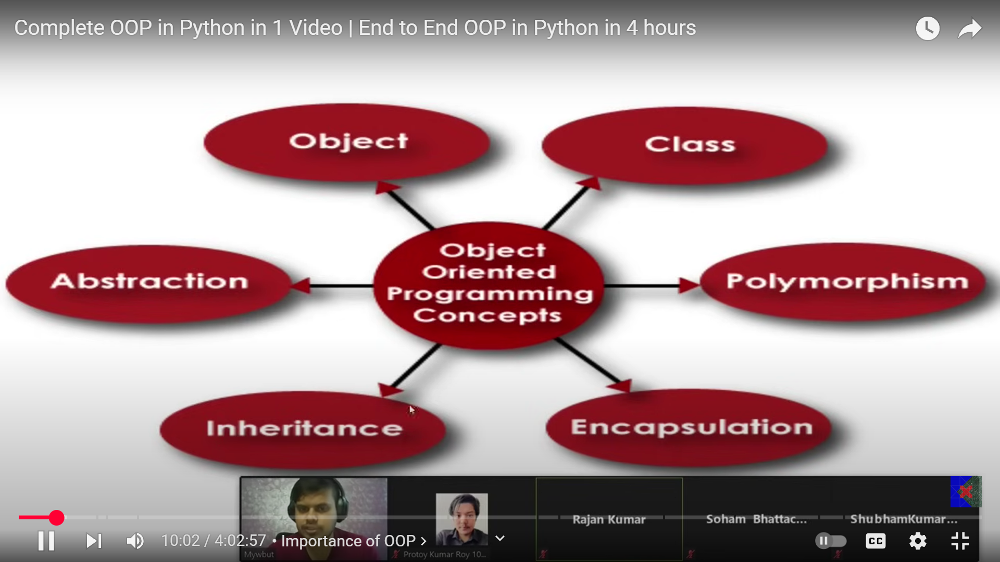
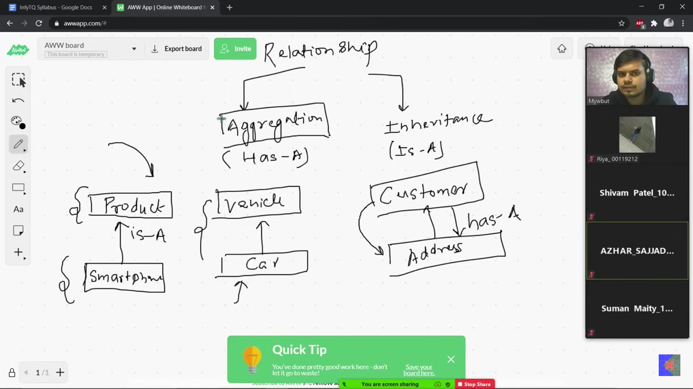
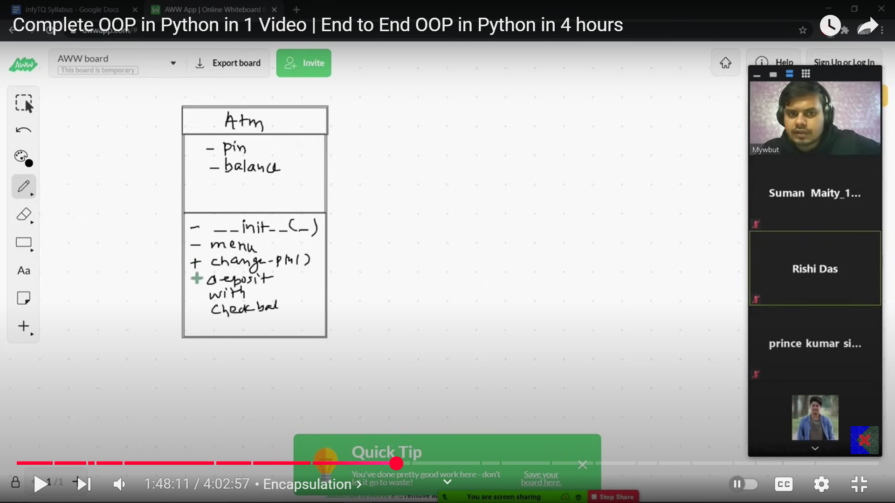
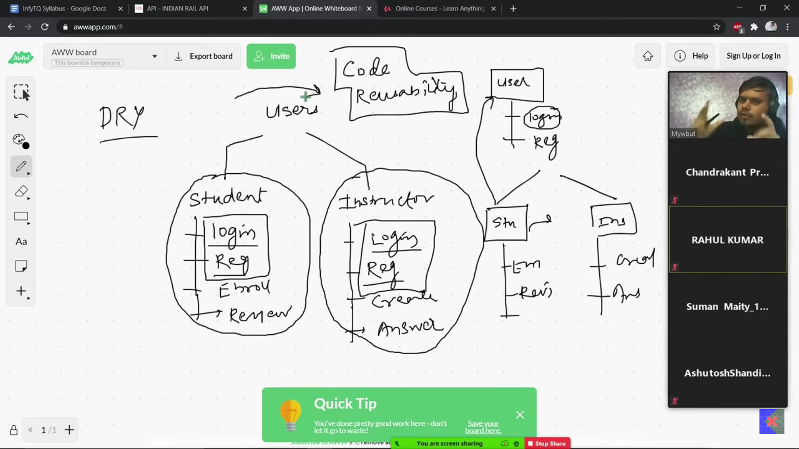
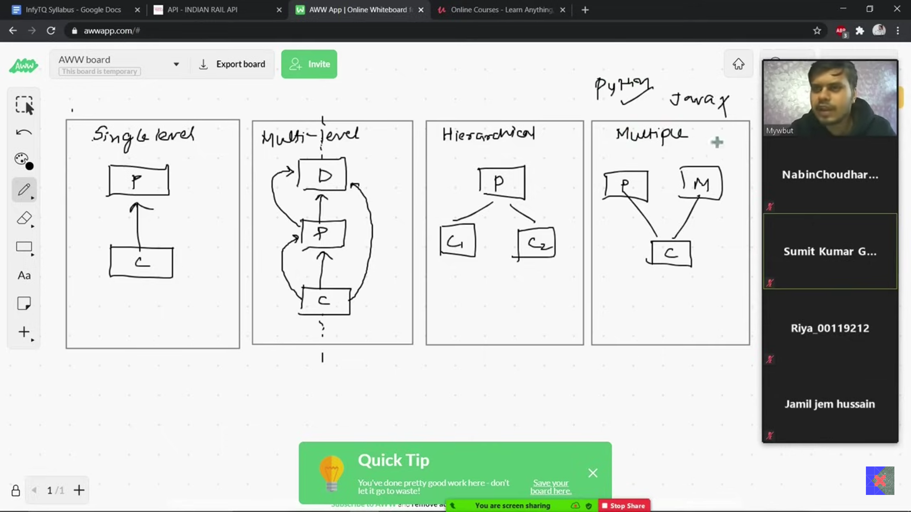

# What is OOP?
- Different style of writing code, more efficient, readable, maintainable, modular. 
- Used practically
```
list = [1,2,3,4,5]
list.upper()

AttributeError: 'list' object has no attribute 'upper'

```
- Everything is an object in Python
  
# What problem does it solve?
- Helps in planning the code, writing efficient code
- Generality to specificity
- Programmer can make his own data types
# Core concepts in OOP


## 1. CLASS
- Blueprint of how an object will behave and what it will do
- If everthing in python is an object, so an object must belong to a class
```
list=[1,2,3,4]   # this object belongs to class list
print(type(list))
<class 'list'>

a = 2   # this object belongs to class int
print(type(a))
<class 'int'>
```
> **So, in Python, we can say that data type is a class and the variable is an object of that class.**

Class has 2 things: Data/Property (noun/description of object) & Method/Function (verb/what object can do)

```
class CarClass:
    model_name = "Corolla"   # data/property
    year = 2023   # data/property

    def calc_avg_speed(parameters): # method/function
        pass
```


## 2. OBJECT
- Instance of a class
```
object = ClassName()
car1 = CarClass()   # car1 is an object of class CarClass
```

**IMPORTANT CONCEPTS:** 

A. **Function**: is any function, can be accessed by anyone  

B. **Method**: is a function that belongs to a class, can be accessed by the object of that class.

C. **Magic/special method**: Starts and ends with double underscores. An object doesn't call these methods. They get called on a given specific criteria automatically. 

    class Fraction():
        def __init__(self, numerator, denominator):
            self.numerator = numerator
            self.denominator = denominator

    fraction = Fraction(2, 3)
    print(fraction)
    
    OUTPUT:
    <__main__.Fraction object at 0x0000018160B4B200>

Python doesn't know how does a fraction look like!

Here comes magic methods:

1. **\__str__ method**

        class Fraction():
            def __init__(self, numerator, denominator):
                self.numerator = numerator
                self.denominator = denominator


            def __str__(self):  # gets executed when you put object inside print
                return "{}/{}".format(self.numerator, self.denominator)

            fraction = Fraction(2, 3)
            print(fraction)

        OUTPUT:
        2/3

2. **\__add__ method**

        def __add__(self, other):  # binary (takes two objects as arguments) gets triggered when we add two objects
            new_numerator = (self.numerator * other.denominator) + (other.numerator * self.denominator)
            new_denominator = self.denominator * other.denominator

            return "{}/{}".format(new_numerator, new_denominator)  # print new fraction


        x = Fraction(2, 3)
        y = Fraction(2, 3)
        print(x+y) 

        OUTPUT: 
        12/9

3. **\__sub__ method**
4. **\__mul__ method**
5. **\__truediv__ method**
    
D. **Constructor**: Magic/Special method that gets called/executed when an object of that class is created. Its control is not given to the user. All the configuration related tasks that should be done automatically when the software opens, should be written inside the constructor.

E. **self**: It is the object with which you are working right now. Jis bhi object k saath aap abhi kaam kr rhe ho, wahi self he. 

   
    class Animal():
    def __init__(self):
        print(id(self))

    cat = Animal()
    print(id(cat))

    2125115978144   # id of self
    2125115978144   # id of cat

> *Only the object can access it's class's data and methods. Even one mehtod cannot access another method or data in it's own class. So, we pass self into the method to receive the object parameter. Also, we use self.method to call the method. In python, obj.class() means the obj is getting passed as the parameter in class() by default.* 


F. **Getter and Setter**: Getter --> A method for private data member to fetch the data if needed. 
 Setter --> Set the private data member's value if needed but according to my set logic, so that nothing crashes

G. **Reference Variable**: In obj = Class(), technically obj is not the object itself, but in fact it is the reference variable that is pointing to the memory location where Class object has been created. 

H. **Pass by Reference**: We can pass our object as argument into a function. It will behave exactly the same as any other object in python like int, string, list, tuple etc. And OBJECTS ARE **MUTABLE**.

    class Customer:
        def __init__(self, name, gender):
            self.name = name
            self.gender = gender

    def greet(customer):
        if customer.gender == "M":
            print(f"Hello {customer.name} Sir!")
        else:
            print(f"Hello {customer.name} Mam!")

        cust2 = Customer("Yusra", "F")
        return cust2


    cust = Customer("mutahar", "M")
    new_cust = greet(cust)  # passing our our object into function as argument, similar to any object in python. receiving the returned object from function
    print(new_cust.name)   # our object will behave exactly same as any other object in Python.


> **- An object can be passed in a function as argument**

**- A function can return an object**

> *If mutable data types like our objects or lists etc are passed by reference into a function, they might get changed because of the function definition. There could be some statements inside the function that could do permanent changes in the original object. But immutable data types won't change.*


I. **Collection of Objects**: We can make a collection of our objects like a list, tuple or dictionary. But not a set because set needs immutable data type and objects are mutable.

J. **Instance variable**: The variable defined in constructor method for which every object's value is different. Always initialized inside the class. Access through self (object)

K. **Static/Class variable**: A variable whose value is same for all objects of the class. Opposite of instance variable. Always initialized outside the class. Access through class.

L. **Static Method**: When dealing with static variables, we use static methods. It doesn't need an object (self) to be passed as parameter because it is not accessing any instance variable, rather it is using only the static/class variables through class name. 

M. **Types of Relationship:** Aggregation & Inheritance
    - **Aggregation**: has-a relationship, when one class needs another class for aggregation. For example, customer has-a address.
    - **Inheritance**: is-a relationship, when one class inherits some properties of another child class. For example, elephant is-a animal.
        


## 3. ENCAPSULATION
- If there is some data/method in a class that should not be publicly visible outside the class, hide it through encapsulation. It can be used inside the class.
- Put __ (double underscore) before the variable/method name to make it private in Python.
- If we try to access the private variable through putting __ before it, it will not be accessed because it will create a new variable instead of accessing that private variable. REASON IS BELOW...
- When we put __, that name gets internally converted to name like this: _ClassName__variable_name. For example, in our Atm example if we hide the pin variable, it will be internally converted to _Atm__pin!
- BUT nothing in Python is truly private. You can still access it through the new name if needed.
- **BUT WHY DO WE NEED ENCAPSULATION?** Because data is sensitive. We cannot let anybody access and modify our data, which could crash our system or do unwanted things. So, we first make it private, and then make two functions getter and setter in case if they need access. 

An example of class diagram where + shows public and - shows private.




## 4. INHERITANCE
- child class inherits the following from parent class:
  - all data members except for the private ones
  - all methods
  - constructor
- helps in code reusability
- follows DRY concept
- always in upward direction, means only child can inherit from parent not vice versa
  


### Types of Inheritance
There are 5 types of inheritance in Python
1. Single level inheritance
   - One child has only one parent. Child can inherit all the properties of parent.
1. Multi-level inheritance
   - Chain of a child and a parent. Grandfather, father, child, grandchild etc. Every child can inherit all the properties of all parents. Grandchild can access it's father as well as grandfather's properties. The chain can grow in both directions.
1. Hierarchichal inheritance
   - One parent has multiple children. Every child can access its parent's properties.
4. Multiple inheritance(*Not applicable in Java*)
   - One child has multiple parents. It can access all properties of all parents. 
   - **MRO - Method Resolution Order:** If both parents have same method, the one that is written first will be inherited first. Order matters in case of conflict.
5. Hybrid inheritance
   - Combination of any of the above.



**points to remember**
- if child has no constructor, parent's constructor will be called
- if child has it's own constructor, then parent's won't be called 
- child can't access parent's private data members
- when a child's object is made and same method is present in both parent and child, then the one in the child will be executed --> method overriding
- super() is a method through which we can access methods and constructor of the parent inside the child class. It doesn't work outside class. Data member's can't be accessed. *It should be the first statement in child's method.*

## 5. POLYMORPHISM 
poly means many, morph means faces --> multiple faces

1. Method Overriding
   - When child and parent have a method with the same name, which one will be called? When a child's object is made and same method is present in both parent and child, then the one in the child will be executed. This way the parent's method will be overridden.
2. Method Overloading
   - When one method performs different function for different inputs. Multiple methods with same name doesn't work in Python because the recent one overwrites the ones before it. *But works in Java.*
   - Technically, it doesn't exist in Python. But can be achieved by using default arguments in the method.
3. Operator Overloading
   - When we make an operator behave other than it's default function, it is operator overloading. 


ALL CREDIT GOES TO [CampusX](https://youtu.be/Mf2RdpEiXjU?si=ztG2XXJyX63sQt6Q)!