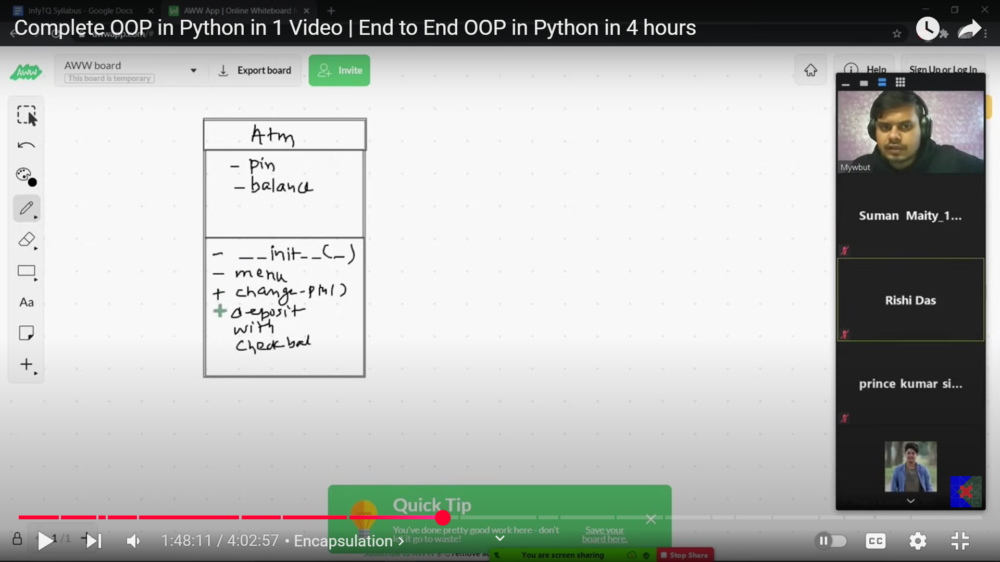

# What is OOP?
- Different style of writing code, more efficient, readable, maintainable, modular. 
- Used practically
```
list = [1,2,3,4,5]
list.upper()

AttributeError: 'list' object has no attribute 'upper'

```
- Everything is an object in Python
  
# What problem does it solve?
- Helps in planning the code, writing efficient code
- Generality to specificity
- Programmer can make his own data types
# Core concepts in OOP


## 1. Class
- Blueprint of how an object will behave and what it will do
- If everthing in python is an object, so an object must belong to a class
```
list=[1,2,3,4]   # this object belongs to class list
print(type(list))
<class 'list'>

a = 2   # this object belongs to class int
print(type(a))
<class 'int'>
```
> **So, in Python, we can say that data type is a class and the variable is an object of that class.**

Class has 2 things: Data/Property (noun/description of object) & Method/Function (verb/what object can do)

```
class CarClass:
    model_name = "Corolla"   # data/property
    year = 2023   # data/property

    def calc_avg_speed(parameters): # method/function
        pass
```


## 2. Object
- Instance of a class
```
object = ClassName()
car1 = CarClass()   # car1 is an object of class CarClass
```

**IMPORTANT CONCEPTS:** 

a. **Function**: is any function, can be accessed by anyone  

b. **Method**: is a function that belongs to a class, can be accessed by the object of that class.

c. **Magic/special method**: Starts and ends with double underscores. An object doesn't call these methods. They get called on a given specific criteria automatically. 

    class Fraction():
        def __init__(self, numerator, denominator):
            self.numerator = numerator
            self.denominator = denominator

    fraction = Fraction(2, 3)
    print(fraction)
    
    OUTPUT:
    <__main__.Fraction object at 0x0000018160B4B200>

Python doesn't know how does a fraction look like!

Here comes magic methods:

1. **\__str__ method**

        class Fraction():
            def __init__(self, numerator, denominator):
                self.numerator = numerator
                self.denominator = denominator


            def __str__(self):  # gets executed when you put object inside print
                return "{}/{}".format(self.numerator, self.denominator)

            fraction = Fraction(2, 3)
            print(fraction)

        OUTPUT:
        2/3

2. **\__add__ method**

        def __add__(self, other):  # binary (takes two objects as arguments) gets triggered when we add two objects
            new_numerator = (self.numerator * other.denominator) + (other.numerator * self.denominator)
            new_denominator = self.denominator * other.denominator

            return "{}/{}".format(new_numerator, new_denominator)  # print new fraction


        x = Fraction(2, 3)
        y = Fraction(2, 3)
        print(x+y) 

        OUTPUT: 
        12/9

3. **\__sub__ method**
4. **\__mul__ method**
5. **\__truediv__ method**
    
d. **Constructor**: Magic/Special method that gets called/executed when an object of that class is created. Its control is not given to the user. All the configuration related tasks that should be done automatically when the software opens, should be written inside the constructor.

e. **self**: It is the object with which you are working right now. Jis bhi object k saath aap abhi kaam kr rhe ho, wahi self he. 

    
    class Animal():
    def __init__(self):
        print(id(self))

    cat = Animal()
    print(id(cat))

    2125115978144   # id of self
    2125115978144   # id of cat

> *Only the object can access it's class's data and methods. Even one mehtod cannot access another method or data in it's own class. So, we pass self into the method to receive the object parameter. Also, we use self.method to call the method. In python, obj.class() means the obj is getting passed as the parameter in class() by default.* 

f. **Instance variable**: The variable defined in constructor method for which every object's value is different.

g. **Getter and Setter**: Getter --> A method for private data member to fetch the data if needed. 
 Setter --> Set the private data member's value if needed but according to my set logic, so that nothing crashes

## 3. Encapsulation
- If there is some data/method in a class that should not be publicly visible outside the class, hide it through encapsulation. It can be used inside the class.
- Put __ (double underscore) before the variable/method name to make it private in Python.
- If we try to access the private variable through putting __ before it, it will not be accessed because it will create a new variable instead of accessing that private variable. REASON IS BELOW...
- When we put __, that name gets internally converted to name like this: _ClassName__variable_name. For example, in our Atm example if we hide the pin variable, it will be internally converted to _Atm__pin!
- BUT nothing in Python is truly private. You can still access it through the new name if needed.
- **BUT WHY DO WE NEED ENCAPSULATION?** Because data is sensitive. We cannot let anybody access and modify our data, which could crash our system or do unwanted things. So, we first make it private, and then make two functions getter and setter in case if they need access. 

An example of class diagram where + shows public and - shows private.

